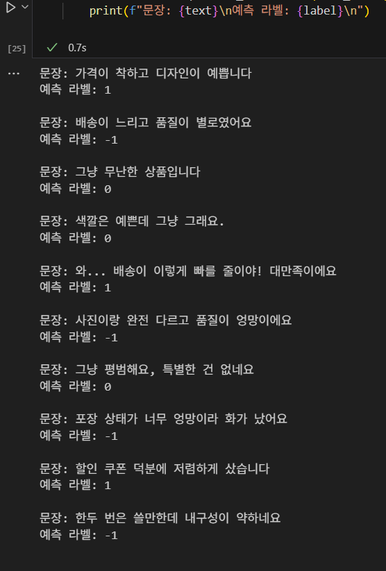

# 👗여성의류 쇼핑몰 리뷰 데이터 감성분석🛍️

 

## 1. 사용 데이터
AI Hub '속성기반 감정분석 데이터' 중 **여성의류 쇼핑몰 리뷰 데이터** 를 사용하였습니다.

 

**데이터셋 컬럼 설명** 
| 컬럼명           | 설명                                                |
|------------------|---------------------------------------------------|
| RawText          | 상품평                                             |
| GeneralPolarity  | 상품평 전체 감정 극성 (-1 : 부정 / 0 : 중립 / 1 : 긍정) |

출처 : https://aihub.or.kr/aihubdata/data/view.do?currMenu=115&topMenu=100&aihubDataSe=realm&dataSetSn=71603

 

## 2. 실행 결과

